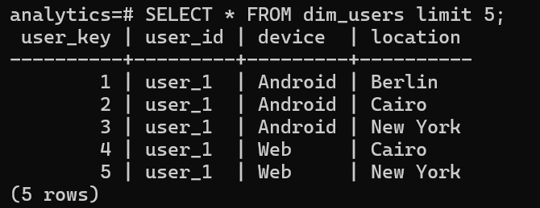
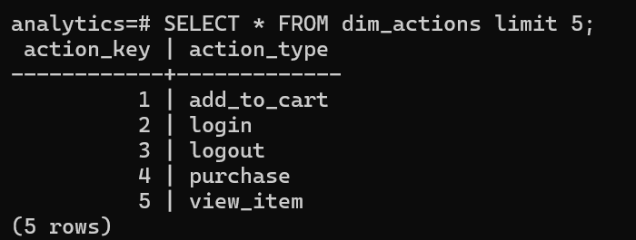
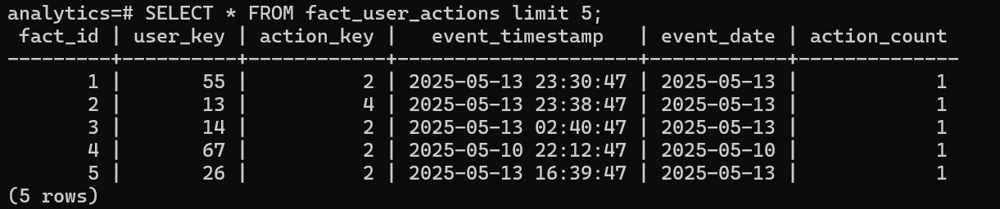

# User Actions ETL Pipeline

A production-ready ETL pipeline that ingests raw mobile app logs from JSON, transforms and validates the data, and loads it into a PostgreSQL data warehouse using a star schema — orchestrated with Apache Airflow and fully containerized with Docker.

---

## Table of Contents

- [Architecture Overview](#architecture-overview)
- [Project Structure](#project-structure)
- [Tech Stack](#tech-stack)
- [Data Model](#data-model-star-schema)
- [ETL Pipeline Flow](#etl-pipeline-flow)
- [Data Quality Checks](#data-quality-checks)
- [Getting Started](#getting-started)
- [Airflow DAG](#airflow-dag)
- [Design Decisions](#design-decisions)
- [Author](#author)

---

## Architecture Overview

The pipeline follows a three-layer architecture:

```
Raw JSON Input
      │
      ▼
┌─────────────────┐
│   Raw Layer     │  ← raw_user_logs (full audit trail)
└─────────────────┘
      │
      ▼
┌─────────────────────────────────┐
│         Transform               │
│  ┌────────────┐ ┌─────────────┐ │
│  │ Valid Data │ │Invalid Data │ │
│  └─────┬──────┘ └──────┬──────┘ │
└────────┼───────────────┼────────┘
         ▼               ▼
┌─────────────────┐  ┌────────────────────┐
│  Curated Layer  │  │ Quarantine Layer   │
│  dim_users      │  │quarantine_user_logs│
│  dim_actions    │  │                    │
│  fact_user_     │  └────────────────────┘
│  actions        │
└─────────────────┘
```

| Layer | Table(s) | Purpose |
|---|---|---|
| **Raw** | `raw_user_logs` | Full audit trail of all ingested records |
| **Quarantine** | `quarantine_user_logs` | Rejected records with rejection reason |
| **Curated** | `dim_users`, `dim_actions`, `fact_user_actions` | Clean star schema for analytics |

---

## Project Structure

```
├── dags/
│   └── user_actions_etl_dag.py   # Airflow DAG definition
├── ETL_Pipeline.py               # Core ETL logic (extract, transform, load)
├── Config.py                     # Environment-based configuration
├── raw_logs.json                 # Sample input data
├── schema.sql                    # PostgreSQL table definitions
├── Dockerfile                    # Airflow container image
├── docker-compose.yml            # Multi-service orchestration
├── requirements.txt              # Python dependencies
└── README.md
```

---

## Tech Stack

| Component | Technology |
|---|---|
| Language | Python 3.x |
| Data Processing | Pandas |
| Database | PostgreSQL 15 |
| Orchestration | Apache Airflow |
| Containerization | Docker & Docker Compose |
| DB Driver | psycopg2 |

---

## Data Model (Star Schema)

```
           ┌─────────────┐
           │  dim_users  │
           │─────────────│
           │ user_key PK │◄──────────────┐
           │ user_id     │               │
           │ device      │               │
           │ location    │               │
           └─────────────┘               │
                                ┌────────────────────┐
           ┌──────────────┐     │  fact_user_actions  │
           │ dim_actions  │     │────────────────────│
           │──────────────│     │ user_key FK        │
           │ action_key PK│◄────│ action_key FK      │
           │ action_type  │     │ event_timestamp    │
           └──────────────┘     │ event_date         │
                                │ action_count       │
                                └────────────────────┘
```

### Supporting Tables

- **`raw_user_logs`** — stores every ingested record before transformation (full audit trail)
- **`quarantine_user_logs`** — stores invalid records with a `rejection_reason` for investigation

---

## ETL Pipeline Flow

### 1. Extract

Reads all records from `raw_logs.json` and pushes them via Airflow XCom to downstream tasks.

### 2. Transform

Each record is processed with the following rules:

| Check | Action on Failure |
|---|---|
| Missing `user_id` or `action_type` | Reject → quarantine |
| Blank `user_id` or `action_type` (after strip) | Reject → quarantine |
| Invalid or unparseable timestamp | Reject → quarantine |
| Duplicate event `(user_id, action_type, timestamp)` | Reject → quarantine |

Valid records are used to build:

- **`dim_users`** — unique `(user_id, device, location)` combinations
- **`dim_actions`** — unique action types
- **`fact_user_actions`** — one row per clean event, normalised to UTC ISO 8601

### 3. Data Quality Checks

Run after transform, before loading to the curated layer. The pipeline raises an error and aborts the curated load if any check fails.

| Check | Expected Result |
|---|---|
| Null `user_id` in `dim_users` | 0 |
| Null `action_type` in `dim_actions` | 0 |
| Null `event_timestamp` in fact table | 0 |
| Duplicate events in fact table | 0 |
| Count reconciliation: `raw = cleaned + rejected` | True |

### 4. Load

Loads are idempotent — `ON CONFLICT DO NOTHING` prevents duplicate inserts on re-runs.

| Destination | Source |
|---|---|
| `raw_user_logs` | All raw records (truncate & reload) |
| `quarantine_user_logs` | Rejected records with rejection reason |
| `dim_users`, `dim_actions` | Deduplicated dimension values |
| `fact_user_actions` | All valid cleaned events |

---

## Getting Started

### Prerequisites

- Docker and Docker Compose installed

### 1. Start All Services

```bash
  docker-compose up --build
```
Run the schema before executing the pipeline:

```bash
  docker exec -i postgres_dw psql -U etl_user -d analytics < schema.sql
```

This will:
- Start a PostgreSQL 15 database
- Initialise the Airflow metadata database and create an admin user
- Start the Airflow webserver and scheduler

### 2. Access the Airflow UI

```
http://localhost:8080
```

| Field | Value |
|---|---|
| Username | `admin` |
| Password | `admin` |

### 3. Trigger the DAG

In the Airflow UI, enable and manually trigger the DAG:

```
user_actions_etl_pipeline
```

### 4. Validate the Results

Connect to PostgreSQL and run:

```sql
SELECT COUNT(*) FROM raw_user_logs;
SELECT COUNT(*) FROM quarantine_user_logs;
SELECT COUNT(*) FROM dim_users;
SELECT COUNT(*) FROM dim_actions;
SELECT COUNT(*) FROM fact_user_actions;
```







Count reconciliation check:
```sql
-- Should equal raw_user_logs count
SELECT
  (SELECT COUNT(*) FROM fact_user_actions) +
  (SELECT COUNT(*) FROM quarantine_user_logs) AS total_processed;
```

---

## Airflow DAG

The DAG `user_actions_etl_pipeline` runs on a `@daily` schedule (with `catchup=False`) and consists of six tasks:

```
extract_raw_logs
       │
       ├──────────────────────┐
       ▼                      ▼
transform_logs         load_raw_to_postgres
       │
       ├──────────────────────┐
       ▼                      ▼
run_quality_checks   load_quarantine_to_postgres
       │
       ▼
load_curated_to_postgres
```

| Task | Description |
|---|---|
| `extract_raw_logs` | Reads `raw_logs.json`, pushes data via XCom |
| `transform_logs` | Cleans, validates, and builds dimension/fact dataframes |
| `run_quality_checks` | Asserts data integrity before curated load |
| `load_raw_to_postgres` | Loads full raw payload to `raw_user_logs` |
| `load_quarantine_to_postgres` | Loads rejected records to `quarantine_user_logs` |
| `load_curated_to_postgres` | Loads clean data to dim/fact tables (gated on DQ checks) |

**Retry policy:** 2 retries with a 5-minute delay.

---

## Design Decisions

**XCom for inter-task data passing**
Data between tasks is passed as serialised JSON via Airflow XCom. This is appropriate for the small-to-medium dataset sizes typical of this use case. For large-scale production workloads, this should be replaced with object storage (S3/GCS) or intermediate staging tables in the database.

**Idempotent loads**
All inserts use `ON CONFLICT DO NOTHING`, making every DAG run safe to re-trigger without creating duplicate records.

**Curated load gated on quality checks**
The `load_curated_to_postgres` task depends on `run_quality_checks` completing successfully. If any quality check fails, the curated layer is never written to, preserving its integrity.

**Quarantine over silent discard**
Rejected records are never silently dropped. Every invalid record is written to `quarantine_user_logs` with a human-readable `rejection_reason`, providing full visibility into data quality issues.

**UTC normalisation**
All timestamps are normalised to UTC ISO 8601 format (`YYYY-MM-DDTHH:MM:SSZ`) during transformation, regardless of the source timezone.

---

## Author

**Sumathi Rajendran**  
Senior Data Engineer